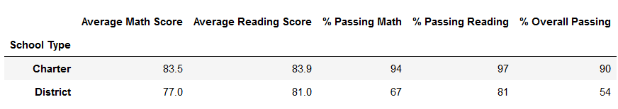
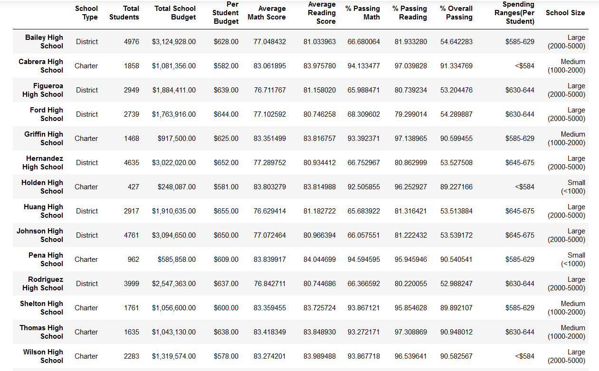
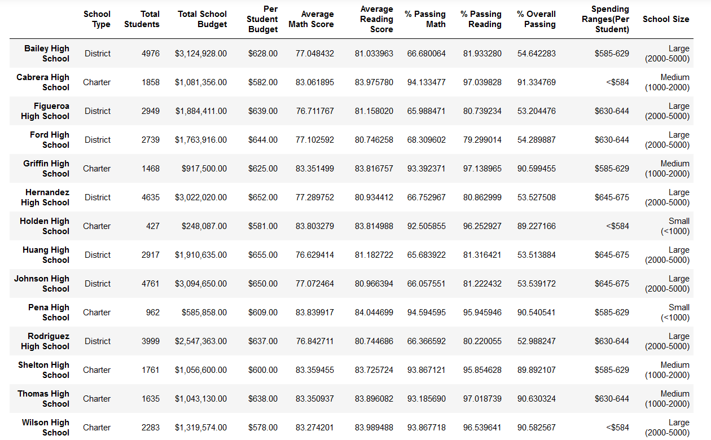

# School_District_Analysis
## Overview of Analysis
The purpose of this analysis was to modify the data for Thomas High School. There was some dishonesty specifically in reading and math grades for ninth grade. Therefore, data had to be replaced only for Thomas High School 9th graders while still leaving the rest of the data the same. 
## Results
* The district summary was not affected by the changes. The image below shows the summary of the average math and reading scores, percentage of passing math and reading, and the overal passing percentage of charters and districts. The summary of the original data was the same.

  
* The school summary was very minimally affected for Thomas High School. The average scores and percentages slightly changed due to removing the ninth grade data. But it didnt have such a great impact on the results. To compare below is the summary for the original analysis.
  
And below is the summary for the analysis removing ninth grade. If you look at Thomas High School you will see the numbers do not differ by much at all.
  
